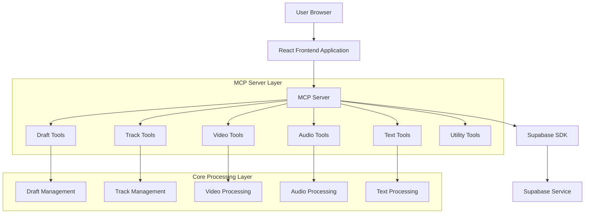
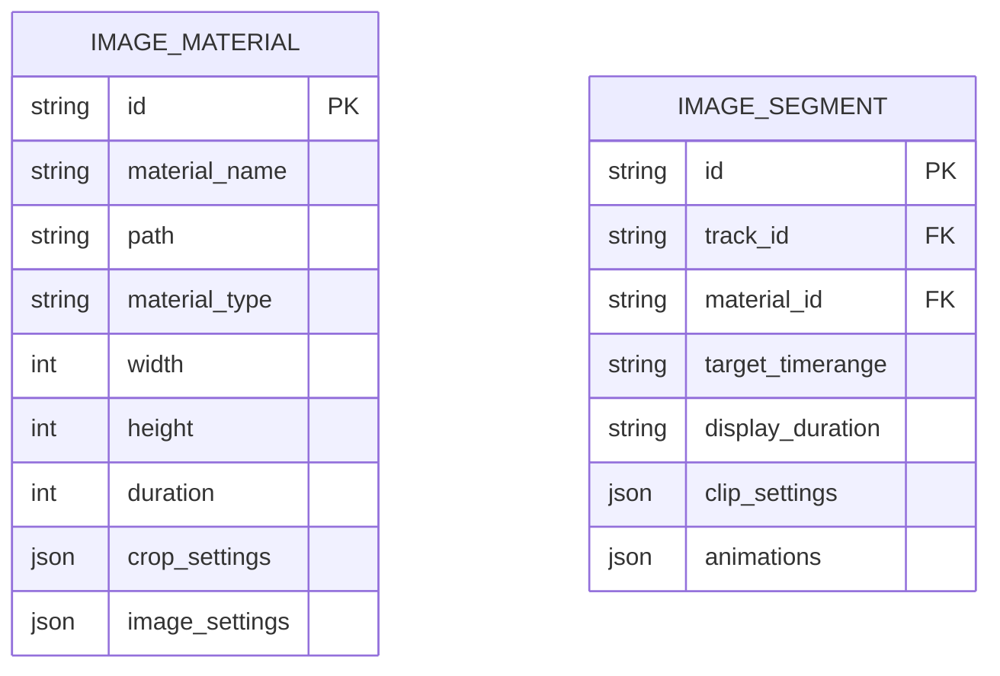

# 剪映MCP添加PNG图片支持技术架构文档

## 1. 当前架构分析

### 1.1 现有架构概述


### 1.2 现有图片支持能力
- **素材处理层**：`local_materials.py`中的`VideoMaterial`类已支持PNG图片
- **媒体解析**：`media_parser.py`可解析图片文件信息
- **素材验证**：`material_validator.py`支持图片格式验证
- **核心处理**：`video_segment.py`可处理图片素材

### 1.3 当前缺失功能
- **MCP工具层**：缺少专门的图片添加API
- **服务层**：缺少图片处理服务函数
- **控制器层**：缺少图片片段管理

## 2. 技术架构设计

### 2.1 增强后架构
```mermaid
graph TD
    A[User Browser] --> B[React Frontend Application]
    B --> C[MCP Server]
    C --> D[Supabase SDK]
    D --> E[Supabase Service]
    
    subgraph "Enhanced MCP Server Layer"
        C --> F[Draft Tools]
        C --> G[Track Tools]
        C --> H[Video Tools]
        C --> I[Audio Tools]
        C --> J[Text Tools]
        C --> K[Utility Tools]
        C --> Z[Image Tools]  <!-- 新增 -->
    end
    
    subgraph "Enhanced Core Processing Layer"
        F --> L[Draft Management]
        G --> M[Track Management]
        H --> N[Video Processing]
        I --> O[Audio Processing]
        J --> P[Text Processing]
        Z --> Q[Image Processing]  <!-- 新增 -->
    end
```

### 2.2 技术栈
- **前端**：React@18 + TailwindCSS@3 + Vite
- **后端**：Python 3.13 + MCP Server
- **媒体处理**：pymediainfo + imageio
- **数据库**：Supabase (PostgreSQL)
- **初始化工具**：vite-init

## 3. 核心API设计

### 3.1 新增MCP工具

#### add_image_segment
```python
@tool()
def add_image_segment(
    track_id: str,
    material: str,
    target_start_end: str,
    display_duration: str = "5s",
    image_settings: Optional[Dict[str, Any]] = None,
    clip_settings: Optional[Dict[str, Any]] = None
) -> ToolResponse:
    """
    添加图片片段到视频轨道
    
    Args:
        track_id: 轨道ID
        material: 图片文件路径或URL，支持PNG、JPG等格式
        target_start_end: 片段在轨道上的时间范围，如"0s-5s"
        display_duration: 图片显示持续时间，默认5秒
        image_settings: 图片显示设置（缩放、位置等）
        clip_settings: 图像调节设置（亮度、对比度等）
    """
```

#### add_image_animation
```python
@tool()
def add_image_animation(
    image_segment_id: str,
    animation_type: str,
    animation_name: str,
    duration: Optional[str] = None
) -> ToolResponse:
    """
    为图片片段添加动画效果
    
    Args:
        image_segment_id: 图片片段ID
        animation_type: 动画类型（"IntroType", "OutroType", "GroupAnimationType"）
        animation_name: 动画名称
        duration: 动画持续时间
    """
```

### 3.2 路由定义

| Route | Purpose |
|-------|---------|
| / | Home page, displays main content and navigation |
| /login | Login page, allows users to authenticate |
| /profile | User profile page, displays user information and settings |
| /dashboard | Dashboard page, provides an overview of user data and actions |

## 4. 数据模型设计

### 4.1 图片素材数据结构


### 4.2 数据库表结构
```sql
-- 图片素材表
CREATE TABLE image_materials (
    id UUID PRIMARY KEY DEFAULT gen_random_uuid(),
    material_name VARCHAR(255) NOT NULL,
    file_path TEXT NOT NULL,
    material_type VARCHAR(20) DEFAULT 'photo',
    width INTEGER,
    height INTEGER,
    duration BIGINT DEFAULT 10800000000,
    crop_settings JSONB,
    image_settings JSONB,
    created_at TIMESTAMP WITH TIME ZONE DEFAULT NOW(),
    updated_at TIMESTAMP WITH TIME ZONE DEFAULT NOW()
);

-- 图片片段表
CREATE TABLE image_segments (
    id UUID PRIMARY KEY DEFAULT gen_random_uuid(),
    track_id UUID REFERENCES tracks(id),
    material_id UUID REFERENCES image_materials(id),
    target_timerange VARCHAR(50) NOT NULL,
    display_duration VARCHAR(20) DEFAULT '5s',
    clip_settings JSONB,
    animations JSONB,
    created_at TIMESTAMP WITH TIME ZONE DEFAULT NOW(),
    updated_at TIMESTAMP WITH TIME ZONE DEFAULT NOW()
);

-- 创建索引
CREATE INDEX idx_image_materials_name ON image_materials(material_name);
CREATE INDEX idx_image_segments_track_id ON image_segments(track_id);
```

## 5. 服务层架构

### 5.1 图片服务层
```python
# jianyingdraft/services/image_service.py

class ImageService:
    def __init__(self, draft_id: str):
        self.draft_id = draft_id
        self.image_materials = []
        self.image_segments = []
    
    def add_image_material(self, material_path: str, settings: Dict) -> str:
        """添加图片素材"""
        # 1. 验证图片格式
        # 2. 解析图片信息（尺寸、格式等）
        # 3. 创建素材记录
        # 4. 返回素材ID
    
    def add_image_segment(self, track_id: str, material_id: str, 
                         timerange: str, duration: str) -> str:
        """添加图片片段"""
        # 1. 验证轨道存在
        # 2. 创建片段记录
        # 3. 关联素材和轨道
        # 4. 返回片段ID
```

### 5.2 权限管理
```sql
-- 基本访问权限
GRANT SELECT ON image_materials TO anon;
GRANT SELECT ON image_segments TO anon;

-- 完整访问权限
GRANT ALL PRIVILEGES ON image_materials TO authenticated;
GRANT ALL PRIVILEGES ON image_segments TO authenticated;
```

## 6. 实现步骤

### 6.1 第一阶段：基础功能
1. 创建`image_service.py`服务层
2. 实现`add_image_segment`工具函数
3. 添加图片素材验证逻辑
4. 更新MCP服务器注册

### 6.2 第二阶段：增强功能
1. 实现`add_image_animation`动画支持
2. 添加图片特效处理
3. 支持图片批量导入
4. 优化错误处理

### 6.3 第三阶段：高级功能
1. 支持图片转场效果
2. 添加图片滤镜功能
3. 实现图片关键帧动画
4. 支持动态图片(GIF)

## 7. 用户界面设计

### 7.1 设计规范
- **主色调**：蓝色系 (#3B82F6, #1E40AF)
- **按钮样式**：圆角矩形，3D阴影效果
- **字体**：系统默认字体，标题16px，正文14px
- **布局**：卡片式布局，响应式设计
- **图标**：使用emoji或简洁线条图标

### 7.2 响应式设计
- **桌面优先**：主要面向桌面端用户
- **移动端适配**：支持平板和手机浏览
- **触摸优化**：按钮大小适合触摸操作

## 8. 错误处理与验证

### 8.1 输入验证
- 文件格式验证（PNG、JPG、JPEG）
- 文件大小限制（最大50MB）
- 图片尺寸验证（最小100x100px）
- URL有效性验证

### 8.2 错误处理
```python
try:
    # 图片处理逻辑
except FileNotFoundError:
    return ToolResponse(success=False, message="图片文件不存在")
except ValueError as e:
    return ToolResponse(success=False, message=f"图片格式错误: {str(e)}")
except Exception as e:
    return ToolResponse(success=False, message=f"图片处理失败: {str(e)}")
```

## 9. 性能优化

### 9.1 缓存策略
- 素材信息缓存（尺寸、格式等）
- 缩略图生成与缓存
- 网络素材本地缓存

### 9.2 异步处理
- 大文件异步上传
- 批量处理优化
- 后台任务队列

## 10. 测试策略

### 10.1 单元测试
- 图片格式验证测试
- 素材解析测试
- 服务层逻辑测试

### 10.2 集成测试
- MCP工具链测试
- 端到端流程测试
- 错误场景测试

### 10.3 性能测试
- 大文件处理测试
- 并发处理测试
- 内存使用测试

这个技术架构文档详细规划了如何为剪映MCP添加PNG图片支持功能，从现有架构分析到具体实现方案，为开发提供了完整的技术指导。