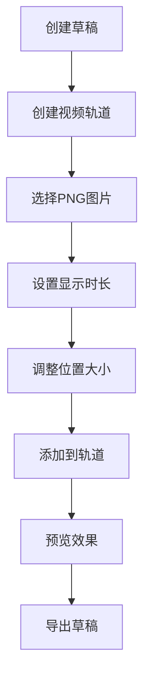
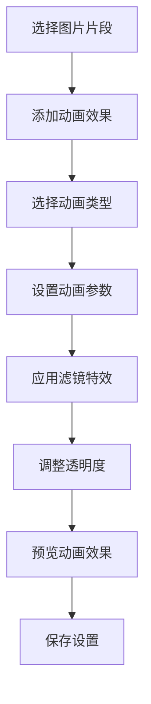

# 剪映MCP添加PNG图片支持产品需求文档

## 1. 产品概述

剪映MCP目前专注于视频、音频和文本处理，但缺乏对静态图片素材的直接支持。用户需要通过添加PNG图片到剪映草稿的功能来创建更丰富的视频内容，如logo叠加、图片展示、背景图片等应用场景。

本功能将让AI助手能够通过自然语言指令，自动将PNG图片添加到剪映视频项目中，实现图片与视频的混合编辑。

## 2. 核心功能

### 2.1 用户角色
| Role | Registration Method | Core Permissions |
|------|---------------------|------------------|
| Free User | Email registration | 基础图片添加功能，有限制的图片数量 |
| Premium User | Subscription upgrade | 高级图片特效，无限制图片数量，批量导入 |

### 2.2 功能模块

图片支持功能包含以下核心页面：
1. **图片添加页面**：选择图片文件、设置显示时长、调整位置大小
2. **图片编辑页面**：应用动画效果、添加滤镜、设置透明度
3. **图片管理页面**：查看已添加图片、批量操作、素材库管理

### 2.3 页面详情

| Page Name | Module Name | Feature description |
|-----------|-------------|---------------------|
| 图片添加页面 | 文件选择模块 | 支持本地文件选择、网络URL输入、拖拽上传PNG图片 |
| 图片添加页面 | 显示设置模块 | 设置图片显示持续时间、开始时间、默认5秒显示 |
| 图片添加页面 | 位置调整模块 | 调整图片在视频画面中的位置和大小，支持缩放和移动 |
| 图片编辑页面 | 动画效果模块 | 为图片添加入场、出场、循环动画效果，支持20+种动画 |
| 图片编辑页面 | 滤镜特效模块 | 应用色彩滤镜、风格化效果，支持实时预览 |
| 图片编辑页面 | 透明度设置模块 | 调整图片透明度，支持0-100%精确控制 |
| 图片管理页面 | 素材列表模块 | 显示所有已添加的图片素材，支持搜索和筛选 |
| 图片管理页面 | 批量操作模块 | 支持批量删除、批量应用特效、批量调整时长 |

## 3. 核心流程

### 3.1 基本图片添加流程

### 3.2 高级图片编辑流程

## 4. 用户界面设计

### 4.1 设计规范
- **主色调**：蓝色渐变 (#3B82F6 → #1E40AF)
- **按钮样式**：圆角矩形，悬停3D效果
- **字体规范**：
  - 标题：18px 粗体
  - 正文：14px 常规
  - 说明文字：12px 灰色
- **布局风格**：卡片式布局，左右分栏设计
- **图标风格**：扁平化emoji风格，简洁易懂

### 4.2 页面设计概述

| Page Name | Module Name | UI Elements |
|-----------|-------------|-------------|
| 图片添加页面 | 文件选择区域 | 拖拽上传框，支持PNG/JPG格式，最大50MB，蓝色边框虚线设计 |
| 图片添加页面 | 预览区域 | 实时显示选中图片，支持缩放预览，显示原始尺寸信息 |
| 图片添加页面 | 时间设置 | 滑块控制显示时长，1-60秒范围，默认5秒，显示时间刻度 |
| 图片编辑页面 | 动画面板 | 网格布局显示动画效果，图标+文字，支持悬停预览 |
| 图片编辑页面 | 滤镜面板 | 横向滚动列表，实时预览滤镜效果，强度滑块控制 |
| 图片编辑页面 | 透明度控制 | 圆形滑块设计，0-100%显示，实时预览透明效果 |
| 图片管理页面 | 素材网格 | 缩略图网格布局，显示文件名和时长，支持多选操作 |

### 4.3 响应式设计
- **桌面端优先**：主要面向桌面端视频编辑用户
- **平板适配**：支持横屏模式下的触摸操作
- **移动端简化**：保留核心功能，简化操作流程

## 5. 技术规格

### 5.1 支持的图片格式
- **主要格式**：PNG（推荐，支持透明背景）
- **兼容格式**：JPG/JPEG、BMP、WebP
- **限制规格**：
  - 最大文件大小：50MB
  - 最小分辨率：100x100像素
  - 最大分辨率：8000x8000像素

### 5.2 性能要求
- **加载速度**：本地图片<1秒，网络图片<3秒
- **预览响应**：参数调整后<200ms响应
- **导出效率**：单张图片导出<5秒

### 5.3 动画效果库
支持以下动画类型：
- **入场动画**：淡入、滑入、缩放、旋转、弹跳等12种
- **出场动画**：淡出、滑出、收缩、翻转等12种  
- **循环动画**：脉冲、摇摆、闪烁等8种

## 6. 用户体验优化

### 6.1 交互优化
- **拖拽上传**：支持文件拖拽到指定区域
- **实时预览**：所有参数调整实时显示效果
- **撤销重做**：支持操作历史记录
- **快捷键**：常用功能支持键盘快捷键

### 6.2 错误处理
- **友好提示**：用通俗易懂的语言描述错误
- **恢复建议**：提供错误解决方案
- **重试机制**：网络错误支持自动重试
- **备份机制**：自动保存用户操作

### 6.3 辅助功能
- **加载状态**：显示操作进度和剩余时间
- **操作确认**：重要操作需要二次确认
- **帮助文档**：内置功能说明和使用教程
- **反馈渠道**：提供用户反馈入口

## 7. 商业模式

### 7.1 免费功能
- 基础图片添加功能
- 5种基础动画效果
- 标准滤镜效果
- 每月10张图片限制

### 7.2 高级功能（付费）
- 全部动画效果库
- 高级滤镜和特效
- 批量图片处理
- 无使用数量限制
- 优先技术支持

## 8. 数据分析需求

### 8.1 用户行为分析
- 图片添加频率和时长偏好
- 动画效果使用统计
- 滤镜效果受欢迎程度
- 用户留存和转化率

### 8.2 性能监控
- 图片加载和处理时间
- 错误发生频率和类型
- 用户操作路径分析
- 功能使用热力图

## 9. 安全与合规

### 9.1 内容安全
- 图片内容审核机制
- 违规内容过滤
- 用户举报处理
- 版权保护机制

### 9.2 数据保护
- 用户图片本地存储加密
- 网络传输HTTPS加密
- 定期数据备份
- GDPR合规性保障

## 10. 未来扩展规划

### 10.1 短期目标（1-3个月）
- GIF动图支持
- 更多动画效果
- 图片模板库
- 协作编辑功能

### 10.2 长期愿景（6-12个月）
- AI智能图片优化
- 云端素材库
- 移动端完整支持
- 第三方集成API

这个产品需求文档详细规划了为剪映MCP添加PNG图片支持的完整功能规格，为开发团队提供了清晰的产品设计方向和用户需求定义。